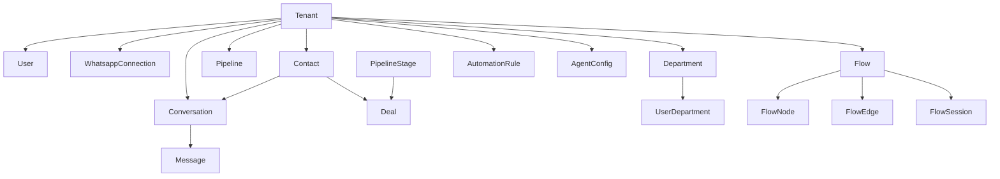

# Resumo do Projeto: HBFlow - WhatsApp CRM & Multiatendimento

Este documento fornece um mapeamento detalhado e uma análise técnica da estrutura do projeto **HBFlow**, abordando a arquitetura geral, o banco de dados (Prisma/PostgreSQL), os módulos do frontend (Next.js) e o funcionamento da camada de agentes inteligentes (AI Workforce Layer).

---

## 💻 1. Arquitetura e Stack Tecnológica

O **HBFlow** é construído como uma aplicação web moderna de alta performance, utilizando as seguintes tecnologias:
*   **Framework**: Next.js 16.2.7 (React 19.2.4).
*   **Estilização**: Tailwind CSS v4.0.0 (utilizando `@tailwindcss/postcss`).
*   **Gerenciamento de Estado**: Zustand (`src/store/useStore.ts`) para sincronização reativa de estado global e simulações do frontend.
*   **Banco de Dados**: Prisma ORM v6.19.3 conectado ao banco de dados PostgreSQL (preparado para Vercel Neon).
*   **Processamento Assíncrono (Fila)**: BullMQ com Redis (`src/lib/queue.ts`), com fallback automático em memória para desenvolvimento local.
*   **Tempo Real**: Comunicação via WebSockets / Socket.io (`src/lib/socket.ts`) para presença e intervenções, com fallback para `CustomEvents` no navegador.
*   **Validação de Dados**: Zod v4.4.3 para validações de schemas e entradas.

---

## 🗃️ 2. Mapeamento do Banco de Dados (Prisma Schema)

O arquivo [schema.prisma](file:///c:/Users/HB%20Studio%2520Dev/Documents/Site/hbflow/prisma/schema.prisma) define uma estrutura multi-tenant estrita e abrangente, dividida logicamente em 12 blocos funcionais:



### Detalhamento das Entidades:

1.  **Autenticação & Multi-inquilinato (Multi-Tenant)**
    *   `Tenant`: Representa a empresa/inquilino (nome, slug, plano de assinatura: starter, pro, enterprise).
    *   `User`: Usuários do sistema (nome, e-mail, senha criptografada, cargo/perfil, assinatura e posição).
    *   `Role` & `Permission`: Sistema de controle de acessos baseado em cargos e permissões de grão fino (ex: `inbox:read`, `pipeline:write`).
    *   `UserPermission`: Tabela de junção n-para-n de usuários e permissões específicas.

2.  **Conexões do WhatsApp**
    *   `WhatsappConnection`: Dados das contas integradas via API Oficial do WhatsApp Business (PhoneNumber, PhoneID, WabaID, AccessToken criptografado, VerifyToken de webhook, status da conexão).

3.  **CRM & Contatos**
    *   `Contact`: Contatos de clientes (nome, telefone, e-mail, CPF/CNPJ, localização, origem do lead, score, histórico financeiro).
    *   `Tag` & `ContactTag`: Sistema de categorização por marcadores coloridos vinculados a contatos.

4.  **Atendimento & Mensagens**
    *   `Conversation`: Sessões de atendimento (Status: new, open, pending, closed, favorite; SLA do chamado, usuário responsável e departamento).
    *   `ConversationParticipant`: Operadores em tempo real na mesma conversa.
    *   `Message`: Registro individual de mensagens recebidas/enviadas (tipo: texto, imagem, áudio, localização; conteúdo, autoria, wamid do WhatsApp).
    *   `MessageAttachment`: Arquivos de mídia e documentos vinculados.
    *   `MessageStatus`: Status de confirmação do WhatsApp (enviada, entregue, lida, falhou com erro).

5.  **Recursos de Automatização**
    *   `QuickReply`: Atalhos de respostas rápidas cadastrados para operadores humanos (ex: `/pix`, `/obrigado`).
    *   `MessageTemplate`: Modelos aprovados pela API do WhatsApp para disparos ativos.

6.  **Pipeline Comercial (Kanban)**
    *   `Pipeline` & `PipelineStage`: Funil de vendas parametrizável (etapas como "Novo Lead", "Proposta Enviada").
    *   `Deal`: Oportunidades comerciais vinculadas a um contato, valor esperado, probabilidade e status (open, won, lost).
    *   `DealActivity`: Linha do tempo de interações do negócio (mudanças de etapa, anotações de progresso).

7.  **Agendas & Tarefas**
    *   `Task`: Tarefas criadas manualmente ou por agentes de IA (ligação, proposta, follow-up, reunião), com prioridade, prazo e status de conclusão.

8.  **Filas e Roteamento de Chamados**
    *   `Department`: Setores da empresa (Vendas, Suporte, Financeiro) com regras de distribuição (manual, rodízio/round-robin, carga de trabalho/workload), mensagens de saudação/ausência e tempos de SLA.
    *   `UserDepartment`: Prioridades e status de atendentes nas respectivas filas de departamentos.
    *   `RoutingFilter` & `UserRoutingFilter`: Filtros baseados em habilidades de atendimento.
    *   `ConversationRoutingFilter`: Filtros e tags de habilidade aplicados à conversa.

9.  **Construtor Visual de Fluxos (Flow Builder)**
    *   `Flow`: Fluxo de autoatendimento configurado visualmente.
    *   `FlowNode`: Nós do fluxo (mensagem simples, pergunta com opções, adição de tag, transição para departamento).
    *   `FlowEdge`: Conexões condicionais que determinam a transição entre os nós com base na resposta do cliente.
    *   `FlowSession`: Contexto ativo de um cliente dentro de um fluxo automatizado.

10. **Regras de Automação Globais**
    *   `AutomationRule` & `AutomationExecution`: Gatilhos (mensagem recebida, tempo inativo) que executam ações parametrizadas no sistema.

11. **Administração e Auditoria**
    *   `WebhookEvent`: Logs de payloads brutos recebidos do webhook do WhatsApp.
    *   `AuditLog`: Trilha de auditoria das ações administrativas dos usuários.
    *   `Notification`: Alertas gerados aos atendentes (SLA estourando, novos chats).
    *   `BusinessHours`: Definição de horários de funcionamento semanal.
    *   `SlaRule`: Regras avançadas de reatribuição e alertas de violação de SLA.

12. **Força de Trabalho IA (AI Workforce)**
    *   `AgentConfig`: Ajuste individual de cada agente de IA por inquilino (ligado/desligado, configurações JSON de prompts e temperatura).
    *   `AgentMemory`: Memória semântica de longo prazo de cada cliente (chaves como "preferred_payment_date" ou "lead_interest").
    *   `AgentExecutionLog`: Log de telemetria de chamadas de LLM (custo em USD, tokens, latência, sucesso, provedor e modelo).
    *   `TenantAICost`: Controle orçamentário mensal dos gastos de inteligência artificial de cada inquilino.

---

## 🛠️ 3. Mapeamento das Rotas e Telas (Next.js App Router)

As interfaces do sistema estão sob o diretório `src/app` e compartilham o layout padrão `AppLayout.tsx` com uma barra lateral de controle e um cabeçalho global.

### Módulos e Rotas Disponíveis:
*   [página inicial (Landing Page)](file:///c:/Users/HB%20Studio%2520Dev/Documents/Site/hbflow/src/app/page.tsx): Portal público interativo de apresentação, simulação em tempo real e planos de assinatura.
*   [login](file:///c:/Users/HB%20Studio%2520Dev/Documents/Site/hbflow/src/app/login/page.tsx): Painel de simulação multi-tenant onde é possível escolher a empresa (Tenant) e o perfil do usuário operador para acessar o sistema.
*   [dashboard](file:///c:/Users/HB%20Studio%2520Dev/Documents/Site/hbflow/src/app/dashboard/page.tsx): Visão analítica de volume de chamados, status do funil, métricas de SLA e tempo de resposta.
*   [inbox](file:///c:/Users/HB%20Studio%2520Dev/Documents/Site/hbflow/src/app/inbox/page.tsx): A central de atendimento omnichannel. Permite responder mensagens do WhatsApp, ver sussurros da IA, transcrever áudio, classificar leads (quente, morno, frio), adicionar notas internas e visualizar tarefas.
*   [pipeline (CRM)](file:///c:/Users/HB%20Studio%2520Dev/Documents/Site/hbflow/src/app/pipeline/page.tsx): Kanban interativo de vendas com movimentação drag-and-drop de cards de negócios comerciais.
*   [conexao (WhatsApp Setup)](file:///c:/Users/HB%20Studio%2520Dev/Documents/Site/hbflow/src/app/conexao/page.tsx): Configuração dos tokens da API Oficial do WhatsApp Business e testes de envio.
*   [fluxos (Chatbot Flow Builder)](file:///c:/Users/HB%20Studio%2520Dev/Documents/Site/hbflow/src/app/fluxos/page.tsx): Construtor drag-and-drop de fluxogramas de resposta automática.
*   [agentes](file:///c:/Users/HB%20Studio%2520Dev/Documents/Site/hbflow/src/app/agentes/page.tsx) / [playground](file:///c:/Users/HB%20Studio%2520Dev/Documents/Site/hbflow/src/app/agentes/playground/page.tsx): Tela para ligar/desligar os 15 agentes de IA, além de um console de simulação direta de prompts e logs das execuções de IA.
*   [roteamento](file:///c:/Users/HB%20Studio%2520Dev/Documents/Site/hbflow/src/app/roteamento/page.tsx) & [setores](file:///c:/Users/HB%20Studio%2520Dev/Documents/Site/hbflow/src/app/setores/page.tsx): Configuração de regras de distribuição automática de chamados por setor.
*   [clientes](file:///c:/Users/HB%20Studio%2520Dev/Documents/Site/hbflow/src/app/clientes/page.tsx): Listagem e detalhamento completo de leads no CRM, incluindo linha do tempo, histórico de chats e memórias da IA.
*   [campanhas](file:///c:/Users/HB%20Studio%2520Dev/Documents/Site/hbflow/src/app/campanhas/page.tsx): Envio em lote de templates oficiais do WhatsApp.
*   [agendamentos](file:///c:/Users/HB%20Studio%2520Dev/Documents/Site/hbflow/src/app/agendamentos/page.tsx): Disparo planejado de lembretes e mensagens futuras.
*   [configuracoes](file:///c:/Users/HB%20Studio%2520Dev/Documents/Site/hbflow/src/app/configuracoes/page.tsx): Ajustes de horários de funcionamento, regras de SLA gerais e chaves de API globais.

---

## 🧠 4. Arquitetura da Camada de Inteligência Artificial (AI Workforce)

A camada de inteligência artificial (`src/agents` e `src/ai-workforce`) é projetada em um modelo hierárquico e modular.

### A Divisão dos 15 Agentes por Níveis de Plano:
*   **Plano Starter**
    *   `triage-agent`: Analisa as mensagens de entrada e decide qual a intenção e para qual departamento direcionar.
    *   `faq-agent`: Busca na base de conhecimento e responde perguntas frequentes automaticamente.
    *   `summary-agent`: Redige resumos das conversas ao serem encerradas ou transferidas.
*   **Plano Pro**
    *   `sdr-agent`: Executa qualificação de leads, perguntando necessidades básicas de forma fluida.
    *   `sales-agent`: Tenta fechar vendas simulando estratégias e técnicas comerciais.
    *   `followup-agent`: Envia mensagens em intervalos agendados para reengajar leads parados.
    *   `billing-agent`: Auxilia no envio de segunda via de boletos, pix e cobranças de faturas atrasadas.
    *   `sentiment-agent`: Detecta a emoção (irritado, calmo, urgente) e alerta sobre risco de perda do cliente (churn).
*   **Plano Enterprise**
    *   `supervisor-agent`: Monitora o tempo de fila e SLAs, notificando supervisores sobre chats abandonados.
    *   `attendant-copilot-agent`: Roda discretamente no chat sugerindo a melhor resposta para o operador humano.
    *   `workflow-agent`: Automatiza ações secundárias do sistema (criar tarefas, mover negócios de etapa).
    *   `commercial-manager-agent`: Avalia a performance geral da equipe e gera insights comerciais.
    *   `sales-coach-agent`: Analisa atendimentos antigos e fornece dicas de melhoria individuais aos operadores.
    *   `forecast-agent`: Projeta faturamento futuro com base na saúde dos negócios no funil.
    *   `audit-agent`: Registra logs de segurança e conformidade das ações da IA.

### Fluxo de Execução Inteligente (Workforce Orchestrator):
```
[Mensagem Recebida] 
        │
        ▼
1. Cost Center ───────► (Verifica saldo disponível do Tenant. Se zerado, bloqueia)
        │
        ▼
2. Semantic Memory ───► (Extrai fatos da mensagem e grava no AgentMemory)
        │
        ▼
3. Agent Registry ────► (Filtra agentes ativos pelo trigger e plano do Tenant)
        │
        ▼
4. Priority Sorter ───► (Ordena execução: Critical -> High -> Medium -> Low)
        │
        ▼
5. Execution Loop ────► (Executa o agente via OpenAI/Anthropic/Groq)
        │
        ▼
6. AI Operations ─────► (Audita o JSON de retorno. Se falhar, força fallback humano)
        │
        ▼
[Respostas Enviadas / Chamados Roteados]
```

### Provedor de IA com Fallback Local:
O arquivo `src/agents/services/ai-provider.service.ts` gerencia as chamadas às APIs reais. Caso as chaves de API não estejam configuradas no ambiente local, o sistema executa um **Provedor Simulado** (`runSimulatedProvider`), gerando respostas JSON estruturadas ideais em menos de 250ms, permitindo o desenvolvimento completo de toda a interface e lógica de negócio sem consumir créditos reais.

---

## 🔒 5. Arquivo de Credenciais e Próximos Passos (Neon DB)

Para dar início ao banco de dados no **Vercel Neon**, criaremos no projeto os arquivos de variáveis de ambiente com os placeholders apropriados.

Para o Prisma operar corretamente com o pool de conexões do Neon (PgBouncer/Serverless Pooler), configuramos duas URLs distintas:
1.  `DATABASE_URL`: Utiliza a porta de pooling (geralmente porta `5432` ou string com `-pooler` do Neon) com `pgbouncer=true` para conexão transacional rápida do Next.js.
2.  `DIRECT_URL`: Conexão direta ao banco (geralmente porta `5432` padrão) para executar migrações e comandos do Prisma CLI (como `prisma migrate dev` ou `prisma db push`) sem restrições de pooling.
